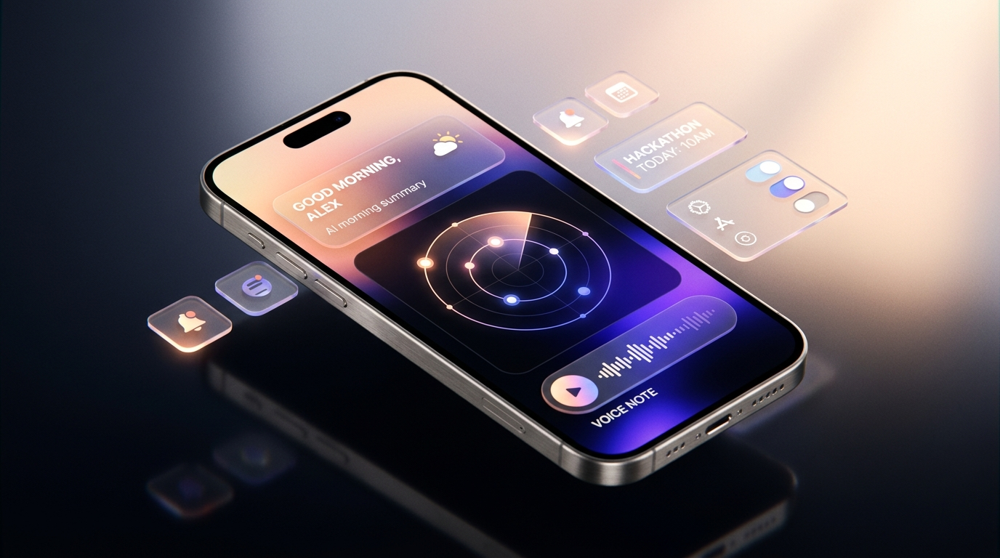

<div align="center">

# 🌅 FIRST LIGHT
### The Privacy-First Morning Brief & Hackathon Radar for Builders

[](https://www.python.org/)
[](https://ai.google.dev/gemma)
[](https://ollama.com)
[](https://developer.mozilla.org/en-US/docs/Web/Progressive_web_apps)
[](https://render.com)
[](LICENSE)

<br/>



<br/><br/>

**Wake up to the 5 things that actually matter today — with zero data leaked to cloud LLMs.**

[Features](#-key-features) •
[Architecture](#-architecture) •
[Quickstart](#-quickstart) •
[PWA Setup](#-mobile-pwa--web-push-setup) •
[Partner Integrations](#-partner-integrations) •
[Demo Video](https://drive.google.com/drive/folders/14fRchsZYuhaCknnAouboAmxr66C3aRZ1?usp=sharing)

</div>

---

## ⚡ The Problem & The Solution

Every morning, builders and hackathon hunters drown in noise: 40 unread newsletters, overlapping calendar invites, fragmented competition deadlines, and endless RSS feeds. 

Handing your personal calendar, private to-dos, and unreleased project ideas to proprietary cloud LLMs creates unacceptable privacy risks. 

**First Light** cuts through the chaos 100% locally on your machine. Every morning at 6:30 AM, it aggregates your personal feeds, normalizes deadlines with exact mathematical precision, synthesizes your top 5 critical items using Google's **Gemma 2B** via Ollama, and delivers a native, lock-screen push notification to your phone.

---

## ✨ Key Features

| Feature | Description |
| :--- | :--- |
| 🔒 **100% Local & Private** | Your calendar, tasks, and notes never leave your computer. Local inference powered by Ollama. |
| 🎯 **Hackathon Radar** | Scrapes & merges active hackathons across **DEV, Devpost, MLH, Kaggle, and Web3/ETHGlobal**. |
| 📐 **Deterministic Math Engine** | Dates, countdowns (`"closes in 13h"`), and urgency scores are computed in Python—eliminating LLM hallucinations. |
| 🔍 **Fuzzy Deduplication** | Cross-posted events across multiple platforms are consolidated via canonical URLs and `rapidfuzz` title matching. |
| 📱 **Native PWA Web Push** | Zero third-party apps (no Telegram/Discord bots). Delivers direct lock-screen notifications using VAPID Web Push. |
| 🎧 **First Light Audio** | Optional high-fidelity morning briefing podcast synthesized on-the-fly with **ElevenLabs TTS**. |
| ☁️ **Seamless Cloud Fallback** | Deployable on **Render** with automatic fallbacks to **Hugging Face Serverless** or **Groq** for Gemma. |
| ✅ **Interactive Dashboard** | Complete to-dos directly from the dawn-themed frosted-glass web UI, syncing state instantly to SQLite. |

---

## 🏗 Architecture

```
                       ┌─────────────────────────┐
                       │  DATA CONNECTORS        │
                       │  • ICS Calendar Files   │
                       │  • Markdown Todos       │
                       │  • Curated RSS Feeds    │
                       │  • 5 Hackathon APIs     │
                       └────────────┬────────────┘
                                    │
                                    ▼
                       ┌─────────────────────────┐
                       │  SQLite Local Database  │
                       │  (Sync & Run Logging)   │
                       └────────────┬────────────┘
                                    │
                  ┌─────────────────┴─────────────────┐
                  ▼                                   ▼
     ┌────────────────────────┐         ┌────────────────────────┐
     │  PYTHON MATH ENGINE    │         │  FUZZY DEDUPLICATION   │
     │  • Urgency calculation │         │  • Canonical URL hash  │
     │  • Countdown strings   │         │  • RapidFuzz matching  │
     └────────────┬───────────┘         └────────────┬───────────┘
                  │                                   │
                  └─────────────────┬─────────────────┘
                                    │ Pre-filtered Facts
                                    ▼
                       ┌─────────────────────────┐
                       │  LOCAL AI (GEMMA 2B)    │
                       │  "Why it matters to you"│
                       │  Pydantic JSON Schema   │
                       └────────────┬────────────┘
                                    │
                  ┌─────────────────┴─────────────────┐
                  ▼                                   ▼
     ┌────────────────────────┐         ┌────────────────────────┐
     │  NATIVE PWA WEB PUSH   │         │  FIRST LIGHT AUDIO     │
     │  • Lock-screen notify  │         │  • ElevenLabs TTS MP3  │
     │  • Mobile ServiceWorker│         │  • In-Dashboard Player │
     └────────────────────────┘         └────────────────────────┘
```

### 🧠 The Core Design Principle: *"Code does dates, AI judges"*
LLMs are notoriously unreliable at temporal arithmetic, date normalization, and relative time calculations. First Light enforces a strict architectural boundary:
1. **Python computes the facts:** Deadlines are parsed into UTC, normalized, and scored into an urgency factor $[0.0, 1.0]$. The exact string (e.g., `closes in 8h`) is generated deterministically.
2. **Gemma provides judgment:** The model is given verified facts and tasked strictly with relevance ranking and contextual reasoning: *"Why does this matter to the user based on their specific profile and interests?"*

---

## 🚀 Quickstart

### Prerequisites
- Python 3.10+
- [Ollama](https://ollama.com/) installed and running locally
- (Optional) `ngrok` for testing mobile Web Push from localhost

### 1. Clone & Install
```bash
git clone https://github.com/Shikhyy/firstlight.git
cd firstlight

python3 -m venv .venv
source .venv/bin/activate
pip install -e .
```

### 2. Initialize Database & Security Keys
```bash
# Set up SQLite schema and generate VAPID cryptographic keys for Web Push
firstlight init-db
python generate_vapid.py
```

### 3. Pull the Local Gemma Model
```bash
ollama run gemma:2b
```

### 4. Run the Pipeline
```bash
# Run full morning pipeline (fetch, dedupe, rank, summarize, and deliver)
firstlight run

# Or run instantly without waiting for LLM generation:
firstlight run --no-ai
```

---

## 📱 Mobile PWA & Web Push Setup

First Light uses native Progressive Web App standards to deliver lock-screen notifications directly to iOS and Android:

1. **Start the Web Dashboard:**
   ```bash
   firstlight web
   ```
2. **Expose with HTTPS (required for Web Push Service Workers):**
   ```bash
   ngrok http 8080
   ```
3. **Install on Mobile:**
   - Open your `https://....ngrok-free.app` URL in mobile Safari or Chrome.
   - Tap **Share ➔ Add to Home Screen**.
   - Launch the newly installed **First Light** app from your home screen.
   - Tap **🔔 Push** in the top navigation bar and select **Allow**.
4. **Trigger Morning Brief:**
   Run `firstlight run` on your Mac. Within seconds, your phone will chime with your personalized lock-screen notification!

---

## ⚙️ Configuration Reference

Personalize your brief via `config.yaml` or directly from the `/onboarding` web UI (**⚙️ Settings**):

```yaml
profile:
  name: "Shikhar"
  interests:
    - "AI"
    - "Machine Learning"
    - "Web3"
    - "Backend"
    - "GPU Infrastructure"

ai:
  model: "gemma:2b"
  top_n_for_model: 5
  timeout_s: 60

integrations:
  sentry_dsn: ""          # Optional: Sentry error & pipeline tracing
  elevenlabs_api_key: ""  # Optional: ElevenLabs API key for audio briefs
  groq_api_key: ""        # Optional: Cloud fallback for Gemma 2 9B
  hf_token: ""            # Optional: Cloud fallback for Hugging Face Gemma 2 2B
```

---

## 🏆 Partner Integrations

Built for the **DEV & Google Open Source AI Hackathon 2026**:

- **Google Gemma:** Core intelligence uses `gemma:2b` for lightweight, on-device summarization and event assessment.
- **ElevenLabs:** Powering **First Light Audio** with realistic text-to-speech morning briefings.
- **Render:** Includes a native `render.yaml` Blueprint for 1-click cloud deployment with persistent disk storage.
- **Sentry Agent Tracing:** Full transaction and pipeline tracing via `sentry-sdk` for total visibility into scraper health and inference timing.
- **Hugging Face:** Serverless inference API fallback support for `google/gemma-2-2b-it`.

---

## ⏰ Automating with Cron

To receive your brief automatically every morning:

```bash
crontab -e
```
Add the following line to schedule the pipeline for 6:30 AM daily:
```cron
30 06 * * * cd /path/to/firstlight && /path/to/firstlight/.venv/bin/firstlight run >> /tmp/firstlight.log 2>&1
```

---

## 📄 License & Credits

Distributed under the **MIT License**. Built with care by [Shikhar](https://github.com/Shikhyy).

> **Hackathon Note:** Any commits pushed after the submission deadline were strictly for README formatting and documentation polish.
